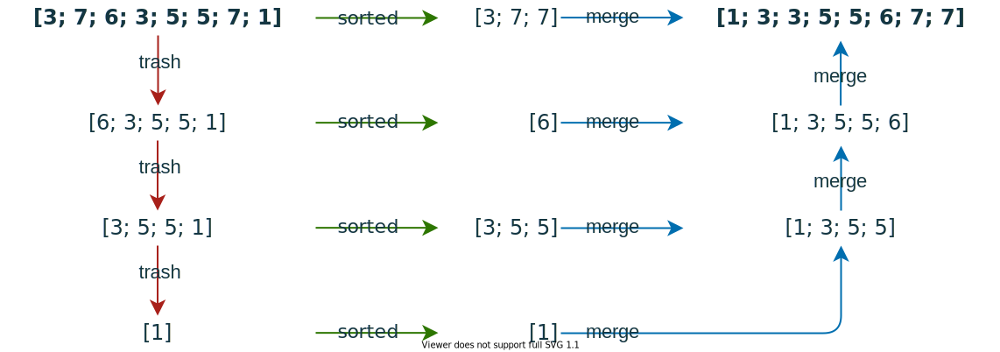

# Merlin Sort

A combination of merge sort and [stalin sort](https://github.com/gustavo-depaula/stalin-sort).

# How it works

1. Perform one iteration of stalin sort.
   - Store the sorted elements in a `sorted` list.
   - Keep the elements that have been thrown out in a `trash` list.
2. Repeat step 1, where the `trash` list of the previous iteration is the input of the new iteration, until the `trash` list is empty. Collect all `sorted` lists in a separate list.
3. Take all the `sorted` lists and perform a reduction over the merge algorithm from merge sort.

## Example

We start with the unordered list `[3; 7; 6; 3; 5; 5; 7; 1]` in the top left, and stop with the sorted list `[1; 3; 3; 5; 5; 6; 7; 7]` in the top right.

# Performance

Terrible, but actually not as bad as I thought it would be. Runtime complexity should be around O(n²) and I don't want to think about space complexity. Here is a "benchmark" that supports this claim (`dotnet fsi -O` with `#time`):

    100.000 random int
    merlinSort: Real: 00:00:07.866, CPU: 00:00:07.921, GC gen0: 1009, gen1: 489, gen2: 3
    List.sort:  Real: 00:00:00.007, CPU: 00:00:00.000, GC gen0:    0, gen1:   0, gen2: 0

    1.000.000 random int
    merlinSort: Real: 00:12:12.323, CPU: 00:11:49.093, GC gen0: 35039, gen1: 15155, gen2: 2900
    List.sort:  Real: 00:00:00.146, CPU: 00:00:00.125, GC gen0:     4, gen1:     2, gen2:    0